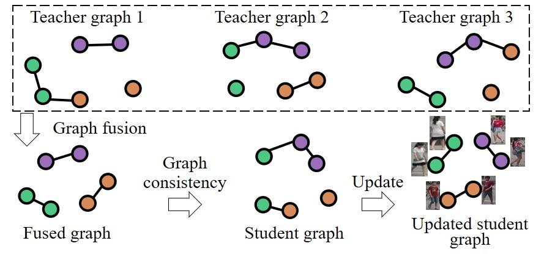

# [GCMT](https://www.ijcai.org/proceedings/2021/121)
   
<!--  -->

Codes of our IJCAI 2021 paper "Graph Consistency based Mean-Teaching for Unsupervised Domain Adaptive Person Re-Identification. Xibin Liu, Shiliang Zhang. IJCAI 2021".

Run `python train.py` will train the unsupervised model on Market-1501 dataset. The unsupervised model trained on Market-1501 can be downloaded from [here](), which achieves % and % in mAP and Rank1 accuracy, respectively.

If you find this paper useful, please kindly cite our paper as follows:

    @inproceedings{ijcai2021-121,
    title     = {Graph Consistency Based Mean-Teaching for Unsupervised Domain Adaptive Person Re-Identification},
    author    = {Liu, Xiaobin and Zhang, Shiliang},
    booktitle = {Proceedings of the Thirtieth International Joint Conference on Artificial Intelligence, {IJCAI-21}},
    publisher = {International Joint Conferences on Artificial Intelligence Organization},
    editor    = {Zhi-Hua Zhou},
    pages     = {874--880},
    year      = {2021},
    month     = {8},
    note      = {Main Track}
    doi       = {10.24963/ijcai.2021/121},
    url       = {https://doi.org/10.24963/ijcai.2021/121},
    }
