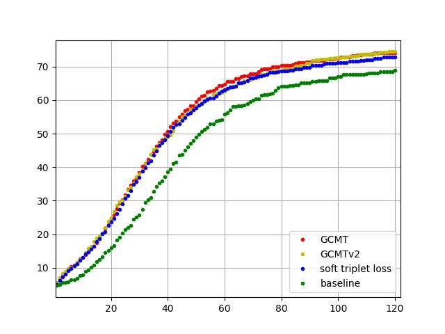

# [Graph Consistency based Mean-Teaching for Unsupervised Domain Adaptive Person Re-Identification](https://www.ijcai.org/proceedings/2021/121)
   

Codes of our IJCAI 2021 paper "Graph Consistency based Mean-Teaching for Unsupervised Domain Adaptive Person Re-Identification. Xiaobin Liu, Shiliang Zhang. IJCAI 2021".

Run `sh train.sh` will train the unsupervised model on Market-1501 dataset. The unsupervised models trained on Market-1501 can be found in folder `log/`, which achieves 74.0% and 90.4% in mAP and Rank1 accuracy, respectively. We find that applying the temperature parameter when computing weights in teacher graph in Eqn.(5) slightly improves the performance and the resulting model is called GCMTv2. The comparison among GCMT, GCMTv2, soft triplet loss, and baseline is shown in the following figure. 

It can be inferred from the figure that more epochs may improve the performance. We will try more epochs in the future. (As DukeMTMC-reID dataset is no longer available, we do not release models related with this dataset.)

If you find this paper useful, please kindly cite our paper as follows:

    @inproceedings{ijcai2021-121,
    title     = {Graph Consistency Based Mean-Teaching for Unsupervised Domain Adaptive Person Re-Identification},
    author    = {Liu, Xiaobin and Zhang, Shiliang},
    booktitle = {Proceedings of the Thirtieth International Joint Conference on Artificial Intelligence, {IJCAI-21}},
    publisher = {International Joint Conferences on Artificial Intelligence Organization},
    editor    = {Zhi-Hua Zhou},
    pages     = {874--880},
    year      = {2021},
    month     = {8},
    note      = {Main Track}
    doi       = {10.24963/ijcai.2021/121},
    url       = {https://doi.org/10.24963/ijcai.2021/121},
    }
